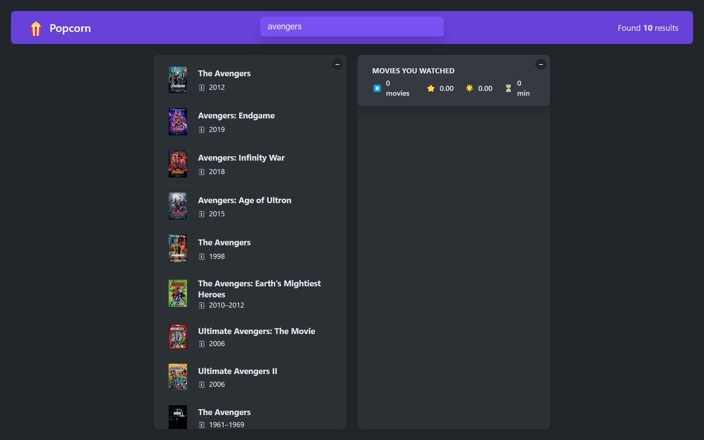
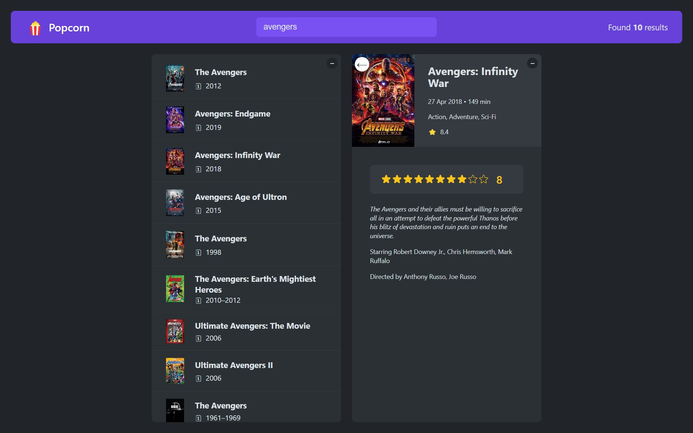
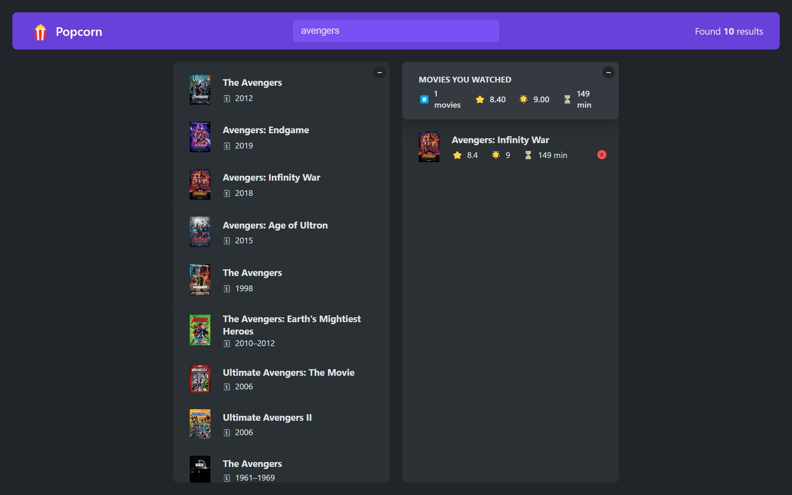

# PopCorn

Popcorn is a React App that allows users to search for movies, view details of movies, rate movies and bookmarking it to their personal watch list.

## Project details

Popcorn allows users to search for movies, view details, and keep track of their watch history. It utilizes the [OMDb](https://www.omdbapi.com/) API to fetch movie data.

# Screenshots

## Features

- Search for movies by title.
- View detailed information about a movie (plot, rating, genre, etc.)
- Add/remove movies to a personal watch list.
- Rate movies and get combined rating of all movies in the personal watch list.
- Keyword Search for movies.
- Star Rating functionality.

## Tech Stack

- React
- javascript
- HTML
- CSS
- Create React App
- Local Storage (for personal watch list)
